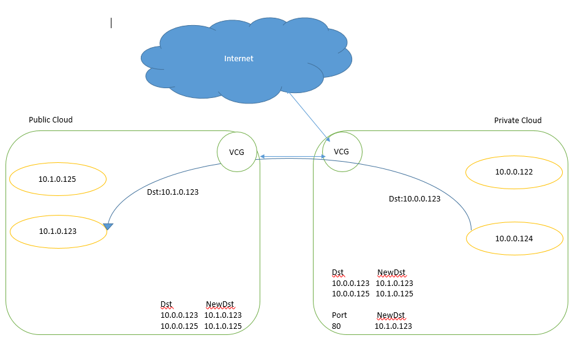

#Cloud Gateway

## Group Members

* Mania Abdi
* Rahul Bahal
* Qianli Ma
* Ayush Singh

## Description

This 

## Intro&Demo Video
[](https://www.youtube.com/watch?v=_ZrianKeo74)


## How to use it?

### 1. Installation

```
# On the VM you wannan use as VCG of provate cloud
# clone this repo
git clone https://github.com/BU-NU-CLOUD-SP16/cloud-gateway.git

# initialize environment
cd cloud-gateway
sudo ./bin/initialize.sh
```
    
### 2. Configuration
You will need to configure you hybird cloud setting in ```./config/config.yaml```, here's an example configuration

```config.yaml
KeyPair: "N Viginia" 
HqPublicIp : "52.26.103.3" 
HqPrivateIp : "10.0.1.121" 
HqCidr : "10.0.0.0/16"

VpcCidr : "10.1.0.0/16" 
PublicCidr : "10.1.0.0/24" 
PrivateCidr : "10.1.1.0/24" 

VcgIp : "10.1.0.100"
VcgServicePort : "6432"
InstanceType : "t2.micro"
# This should be the ubuntu AMI id in default region
ImageId : "ami-fce3c696"
IpsecConfigPath : "/home/ubuntu/ipsec/"
```
